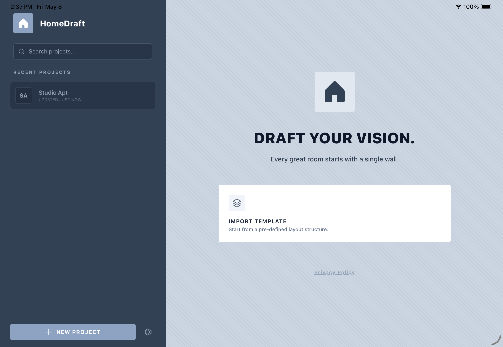
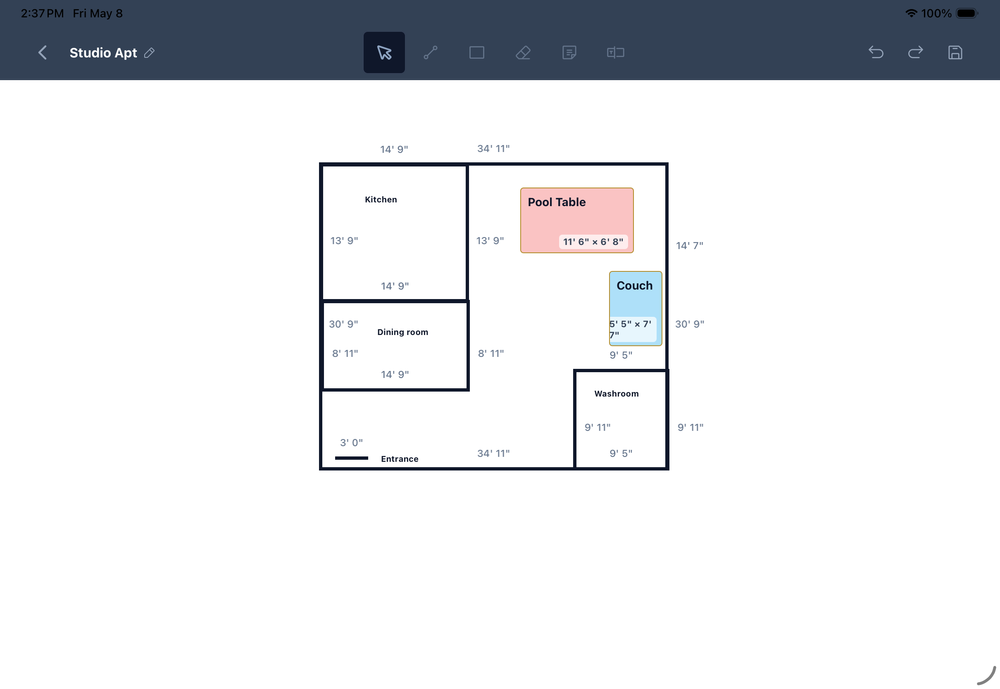

# HomeDraft

A tablet-first 2D floor plan drafting app built with React Native, Expo, and Skia. Draw wall segments on an interactive canvas with snapping, axis locking, and a clean light/dark UI.

---

## Features

- **Skia-powered drawing canvas** — smooth, hardware-accelerated rendering via `@shopify/react-native-skia`
- **Node snapping** — wall endpoints snap to nearby nodes within an 18px radius for clean connections
- **Axis locking** — constrains segments to horizontal or vertical only, keeping plans grid-aligned
- **Minimum segment length** — enforces an 8px minimum to prevent accidental zero-length walls
- **Real-time measurements** — segment lengths display live as you draw
- **Multiple drawing tools** — wall segment, rectangle, eraser, sticky note, and text label
- **Undo/redo and save** — full edit history with toast confirmation on save
- **Local persistence** — canvas saves and loads from a local database with project rename support
- **Project list** — home screen for managing multiple floor plan drafts

---

## Tech Stack

| Layer | Technology |
|---|---|
| Framework | Expo (React Native) + TypeScript |
| Routing | Expo Router (file-based) |
| Canvas rendering | @shopify/react-native-skia |
| Gestures | react-native-gesture-handler |
| Animations | react-native-reanimated |
| Icons | phosphor-react-native |
| Architecture | React New Architecture + React Compiler |
| State | Local React hooks (no global store) |

---

## Getting Started

```bash
npm install
npx expo start
```

Then open in an iOS simulator, Android emulator, or Expo Go.

---

## Screenshots




---

## Project Structure

```
home-draft/
├── app/
│   ├── _layout.tsx           # Root layout with gesture and theme providers
│   ├── index.tsx             # Home screen / project list
│   └── canvas.tsx            # Drawing canvas page with asset library panel
├── components/canvas/
│   ├── drawing-surface.tsx   # Core Skia canvas, snapping, axis lock, gestures
│   └── types.ts              # WallNode and WallSegment data models
├── constants/
│   └── theme.ts              # Light/dark theme tokens
└── hooks/                    # Theme and utility hooks
```
